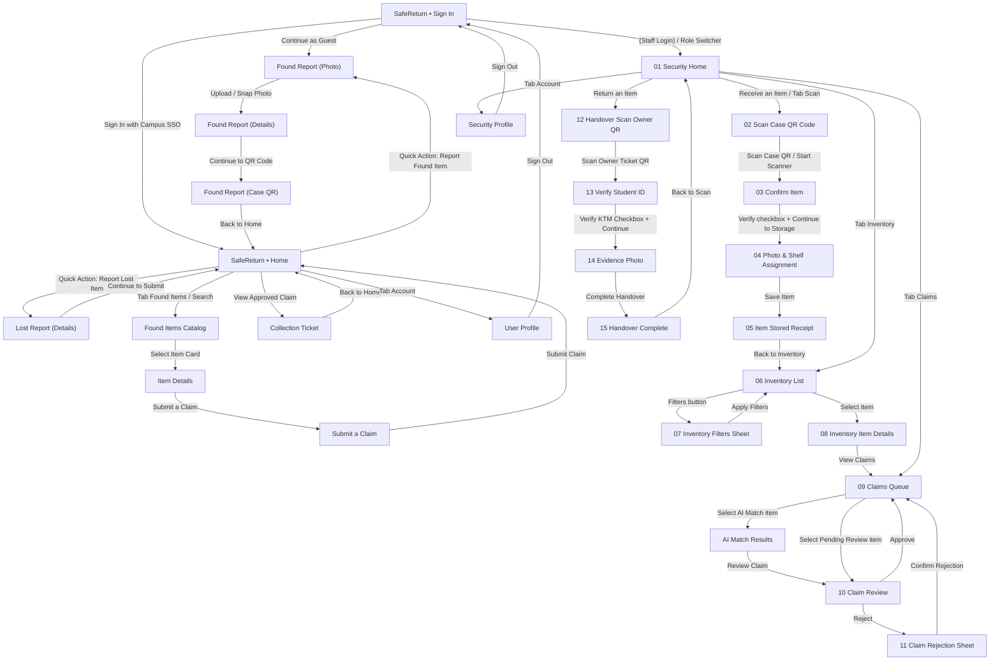

# STAGE 1 — SafeReturn Design Audit & Architecture Specification

## 1. Overview & Inventory of Screens

Berdasarkan audit menyeluruh terhadap 30 frame desain Figma (`c:\Users\keane\Downloads\SafeReturn - UI`), seluruh screen telah dipetakan berdasarkan Role dan status otentikasi.

### A. Guest Role (Tamu / Publik Belum Login)
1. **Sign In (`SafeReturn • Sign In.svg`)**
   - Brand header SafeReturn ("Recover what matters.")
   - Informational checklist ("Report Found Items", "Browse Stored Items", "Claims Reviewed by Security").
   - Notice banner: "Guests can only report found items. Sign in with campus SSO to browse items, report losses, and submit claims." / "Tamu hanya dapat melaporkan barang temuan."
   - Action buttons: `Sign In with Campus SSO` (Masuk SSO Kampus) & `Continue as Guest` (Lanjut sebagai Tamu).
2. **Report Found Item (Alur Pelaporan Barang Temuan - Guest/User)**
   - **Step 1 - Photo (`SafeReturn • Found Report • Details.svg` - sub-state Photo)**: Ambil foto barang bukti temuan.
   - **Step 2 - Details (`SafeReturn • Found Report • Details.svg`)**: Pilih Kategori, Warna, Lokasi Kampus, Tanggal & Waktu.
   - **Step 3 - QR Code (`SafeReturn • Found Report • QR Code.svg`)**: Menampilkan Case QR Code (`SR-20261008-1024`) beserta instruksi serah terima ke pos satpam ("Deliver to the Security Post").

---

### B. User Role (Mahasiswa / Civitas Kampus Login)
1. **User Home (`SafeReturn • Home.svg`)**
   - Header salam personal ("Welcome, Naya"), ikon notifikasi lonceng.
   - Quick Actions: "Report a Found Item" & "Report a Lost Item".
   - My Reports section: Daftar laporan aktif (Found Item Matched, Lost Item Reported) dengan tombol "View Details".
   - Bottom Navigation Bar (3 Tab): `Home`, `Found Items`, `Account`.
2. **Found Items Catalog (`SafeReturn • Found Items.svg`)**
   - Search bar ("Search by category or location").
   - Quick Filter chips/dropdowns: Category, Color, Location, Date.
   - List/Grid kartu barang temuan (dengan foto siluet/foto terpotong tanpa detail identifikasi privat).
3. **Item Details (`SafeReturn • Item Details.svg`)**
   - Foto barang, Status Chip (`Stored`), Nomor kasus (`SR-20261008-1024`).
   - Detail umum: Kategori, Warna, Lokasi Temuan, Tanggal, Waktu.
   - Privacy security banner: "Identifying details are kept private. Answer the verification questions to submit a claim."
   - Action button: `Submit a Claim`.
4. **Report a Lost Item (`SafeReturn • Lost Report • Details.svg`)**
   - Form 2 langkah (Step 1 of 2): Deskripsi barang, Kategori, Warna, Lokasi Terakhir, Tanggal, Waktu, Foto opsional.
   - Action button: `Continue to Submit`.
5. **Submit a Claim (`SafeReturn • Submit a Claim.svg`)**
   - Header ringkasan barang yang diklaim.
   - Bagian Pertanyaan Verifikasi Kepemilikan (Ownership Verification):
     - Pertanyaan 1: "What identifying details are inside the wallet?" / Ciri khusus.
     - Pertanyaan 2: "List the wallet contents you can verify." / Isi barang.
     - Pertanyaan 3: "When and where did you last use it?" / Waktu & tempat terakhir.
   - Info limit: "Up to 3 active claims per account."
   - Action button: `Submit Claim`.
6. **Collection Ticket (`SafeReturn • Collection Ticket.svg`)**
   - Muncul saat klaim disetujui (`Claim Approved`).
   - Menampilkan Pickup QR Code kepemilikan.
   - Info masa berlaku tiket: "Valid for 24 hours. Present this ticket and your student ID (KTM) at the security post."
   - Action button: `Back to Home`.
7. **User Profile (`User Profile • iPhone 17.svg`)**
   - Avatar inisial ("NP"), Nama ("Naya Putri"), Tag "Student".
   - Profil: Nama Lengkap, Email Kampus, NIM / Student ID (`2304101024`).
   - Menu Navigasi: Notifikasi ("Report and claim updates").
   - Action button: `Sign Out`.

---

### C. Guard / Security Role (Petugas Satpam Kampus)
1. **Security Home (`01 Home • Security Home.svg`)**
   - Header SafeReturn Security Mode dengan badge pos jaga ("Main Security Post").
   - Card Info Petugas: Nama Petugas ("Budi Santoso"), Lokasi Pos, Jadwal Shift ("08:00–16:00 WIB").
   - Action Cards:
     - `Receive an Item` (Penerimaan barang dari penemu)
     - `Return an Item` (Pengembalian barang ke pemilik)
     - `Retake the Photo and Assign a Shelf` (Ambil ulang foto & atur nomor rak)
   - Bottom Navigation Bar (4 Tab): `Scan`, `Inventory`, `Claims`, `Account`.
2. **Scan Case QR Code (`02 Scan • Case QR Code.svg`)**
   - Step 1 of 3 (Intake): Scanner kamera QR Code penemu.
   - Instruksi: "Receive the Physical Item First. Compare item with report photo."
   - Action button: `Start Scanner`.
3. **Confirm Item (`03 Intake • Confirm Item.svg`)**
   - Menampilkan foto penemu, Kategori, Warna, Lokasi, Waktu, Nama Penemu ("Dimas Pratama").
   - Checkbox wajib: `[x] The physical item matches the report` ("Barang fisik sesuai laporan").
   - Action button: `Continue to Storage`.
4. **Photo & Shelf Assignment (`04 Intake • Photo and Shelf Assignment.svg`)**
   - Step 2 of 3: Ambil ulang foto resmi petugas (`Retake / Upload Photo`).
   - Input Kategori & Nomor Rak fisik (`Shelf Number *`, misal: `A-03`).
   - Kartu "Security Staff Only": Catatan rahasia ciri identifikasi khusus (misal: "Cream stitching inside, three card slots; library card").
   - Action button: `Save Item`.
5. **Item Stored Receipt (`05 Stored • Item Stored.svg`)**
   - Konfirmasi sukses: Ikon centang hijau, status chip `Stored`.
   - Ringkasan nomor rak (`A-03`), Petugas penerima, Tanggal & Jam.
   - Action button: `Back to Inventory`.
6. **Inventory List (`06 Inventory • Item List.svg`)**
   - Search bar by case code.
   - Filter dropdowns: Category, Shelf, Status.
   - List kartu barang tersimpan: Thumbnail foto, Nama barang, Kode Kasus, Lokasi Rak, Tanggal/Waktu, Status chip `Stored`.
7. **Inventory Filters Bottom Sheet (`07 Inventory • Filters.svg`)**
   - Modal bottom sheet filter: Kategori, Nomor Rak, Status chip (`Reported`, `Stored`, `Matched`, `Claimed`, `Returned`).
   - Action buttons: `Apply Filters` & `Reset Filters`.
8. **Inventory Item Details (`08 Inventory • Item Details.svg`)**
   - Detail lengkap barang di pos: Kategori/Warna, Nomor Rak, Lokasi Temuan, Waktu Temuan, Pelapor, dan Box Rahasia "Security Staff Only".
   - Action button: `View Claims` (Lihat daftar klaim barang ini).
9. **Claim Queue (`09 Claims • Queue.svg`)**
   - Daftar klaim masuk yang menunggu verifikasi petugas (`Pending Review`).
   - Mendukung badge `AI Match Found` dengan indikator persentase kemiripan ("View AI Match · 92%").
10. **Claim Review (`10 Claims • Review.svg` & `SafeReturn • Security • Claim Review.svg`)**
    - Detail pemohon klaim: Nama, NIM/Student ID, Waktu klaim, Status barang.
    - Box "Security Staff Only": Ciri rahasia yang tercatat di sistem.
    - Box "Compare the Claimant's Answers": Jawaban verifikasi yang dimasukkan pemohon.
    - Action buttons: `Approve` (Setujui Klaim) & `Reject` (Tolak Klaim).
11. **Claim Rejection Bottom Sheet (`11 Claims • Rejection.svg`)**
    - Modal konfirmasi penolakan klaim: Alasan penolakan wajib diisi (`Reason *`).
    - Action buttons: `Reject Claim` & `Cancel`.
12. **AI Match Results (`SafeReturn • Security • AI Match Results.svg`)**
    - Perbandingan berdampingan (Side-by-side comparison): Laporan Temuan vs Laporan Kehilangan (Kategori, Warna, Lokasi, Selisih Waktu).
    - Skor kecocokan AI (misal `92% Match Score - High similarity`).
    - Action button: `Review Claim`.
13. **Handover - Scan Owner QR (`12 Handover • Scan Owner QR.svg`)**
    - Step 1 of 3: Scanner tiket QR pengambilan milik pemohon yang disetujui.
14. **Handover - Verify Student ID (`13 Handover • Verify Student ID.svg`)**
    - Step 2 of 3: Menampilkan data pemilik, NIM, masa berlaku tiket.
    - Checkbox verifikasi: `[x] The student ID matches the owner's identity` ("KTM sesuai identitas pemilik").
    - Action button: `Continue to Evidence Photo`.
15. **Handover - Evidence Photo (`14 Handover • Evidence Photo.svg`)**
    - Step 3 of 3: Pengambilan foto bukti serah terima langsung dengan pemohon.
    - Action button: `Complete Handover`.
16. **Handover Complete Receipt (`15 Handover • Complete.svg`)**
    - Tanda terima pengembalian berhasil: Status chip `Returned`, "Item Removed from Shelf A-03".
    - Action button: `Back to Scan`.
17. **Security Profile (`Security Profile • iPhone 17.svg`)**
    - Data petugas satpam: Nama, Email, Officer ID (`SAT-001`), Lokasi Pos Jaga.
    - Action button: `Sign Out`.

---

### D. Supervisor Role (Audit & Read-Only Pengawas)
Sesuai `implementation_plan.md` dan struktur audit:
- Akses audit log transaksi serah terima, inventaris rak, riwayat klaim masuk, alasan penolakan, serta log petugas (read-only audit trail).

---

## 2. Flow Map Lengkap ("Screen A → action → Screen B")

---

## 3. Ekstraksi Design Tokens

### A. Palet Warna (Color Palette)
- **Primary Brand Blue**: `#234CFA` (Tombol utama, tab aktif, border fokus, highlight scanner)
- **Primary Text & Headings**: `#111827` (Gray-900), `#171715`
- **Secondary / Subtitle Text**: `#6B7280` (Gray-500)
- **Border / Divider**: `#E5E7EB` (Gray-200)
- **Background Primary**: `#FFFFFF`
- **Background Card / Surface Muted**: `#F7F8FA`, `#F4F2EA`
- **Status & Accent Colors**:
  - **Success / Green (Claimed, Verified, Approved)**: `#16A34A` (Background chip: `#DCFCE7`)
  - **Teal / Stored**: `#0F766E` (Background chip: `#CCFBF1`)
  - **Warning / Orange (Reported, Pending, Brand Accent)**: `#D97706` (Background chip: `#FEF3C7`)
  - **Danger / Red (Rejection, Error)**: `#DC2626`, `#FF0004` (Background chip: `#FEE2E2`)
  - **Brown Leather Asset**: `#694634`, `#8A6047`, `#B58C70`

### B. Tipografi (Typography)
- **Font Family**: Inter / Plus Jakarta Sans / San Francisco
- **Hierarchy & Scale**:
  - `Display / H1`: 24px, Bold (w700), Line Height 32px
  - `Title / H2`: 20px, SemiBold (w600), Line Height 28px
  - `Headline / H3`: 16px, SemiBold (w600), Line Height 24px
  - `Body Regular`: 14px, Regular (w400), Line Height 20px
  - `Body Medium`: 14px, Medium (w500), Line Height 20px
  - `Caption / Subtext`: 12px, Regular (w400) & Medium (w500), Line Height 16px

### C. Spacing, Radius & Shadows
- **Corner Radii**:
  - Buttons & Cards: `12px` - `16px`
  - Chips & Pills: `100px` (Full rounded)
  - Bottom Sheet Top Radius: `24px`
  - QR Code Card Container: `16px`
- **Paddings & Spacing Scale**:
  - Screen Horizontal Padding: `24px`
  - Section Spacing: `20px` - `24px`
  - Item Card Gap: `12px` - `16px`
  - Control Height (Button/Input): `48px` - `52px`

---

## 4. Recurring Components Inventory

1. **AppHeader / TopBar**:
   - Varian Title + Subtitle.
   - Varian Back Button + Title + Subtitle.
   - Varian Logo + Brand Title + Bell Icon.
2. **CustomButton**:
   - `Primary`: Background `#234CFA`, White text.
   - `Secondary / Outlined`: Border `#234CFA`, Text `#234CFA`, White background.
   - `Muted / Ghost`: Border `#E5E7EB`, Dark text.
   - `Destructive`: Red outline / fill untuk pembatalan/penolakan.
3. **StatusBadge / StatusChip**:
   - Varian: `Reported`, `Stored`, `Matched`, `Claim Approved`, `Pending Review`, `Claimed`, `Returned`.
4. **StepIndicator**:
   - 3-step progress bar (Photo -> Details -> QR Code) dengan garis aktif biru `#234CFA`.
5. **ItemCard (User & Security)**:
   - Thumbnail kotak rounded, Title, Subtitle lokasi, Case ID, Status chip, chevron panah.
6. **QRViewCard**:
   - Wadah putih rounded `16px` berisi QR code dinamis, teks petunjuk di bawahnya.
7. **SecurityNoticeBox**:
   - Background `#F7F8FA`, icon kunci / tameng / info, border tipis, teks instruksi kepatuhan SOP satpam.
8. **BottomNavigationBar**:
   - Role User (3 Item): Beranda (Home), Barang Temuan (Found Items), Akun (Account).
   - Role Security (4 Item): Pindai (Scan), Inventaris (Inventory), Klaim (Claims), Akun (Account).

---

## 5. Analisis Konsistensi & Catatan Arsitektur (Open Questions & Technical Notes)

1. **Dua Varian Auth pada Desain**:
   - Terdapat frame SSO (`SafeReturn • Sign In.svg`) dan frame form email/password (`iPhone 17 - 1.svg`, `iPhone 17 - 2.svg`).
   - *Solusi*: Tampilan utama mengikuti `SafeReturn • Sign In.svg` (SSO Kampus & Guest), dengan opsi direct login / role switcher praktis untuk memudahkan switching role (Mahasiswa, Satpam, Supervisor) selama demonstrasi dan pengujian langsung.
2. **Ketersediaan Flutter Environment**:
   - Di mesin Windows ini, perintah `flutter` belum terdaftar di system PATH (hanya .NET SDK dan Git yang terdeteksi).
   - *Solusi*: Seluruh kode Flutter/Dart akan disusun secara komprehensif, modular, berstandar produksi murni, dan dilengkapi simulator web/preview mandiri sehingga pengujian visual dan fungsional dapat segera diverifikasi langsung tanpa hambatan.
